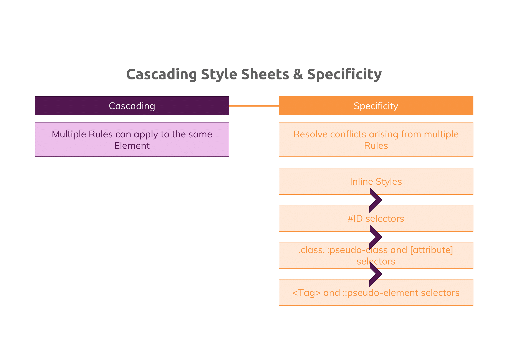
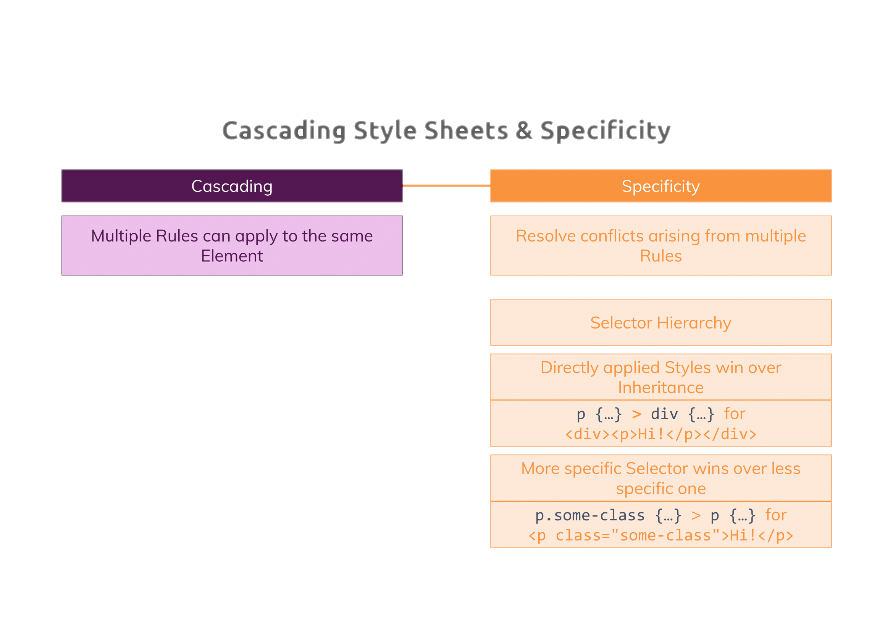

# Lesson 3

Discussing more about Selectors and understanding what "cascading" styles actually means

## More About Selectors

- Element Selector
- Class Selector
- Id Selector
- Univesal Selector
- Attribute Selector

## Understanding "Cascading" Styles and Specificity

Cascading styles mean multiple styles are applied to an element with an overwriting priority as defined by CSS Specificity:

This browser does not support PDFs. Please download the PDF to view it: <a href="https://drive.google.com/file/d/1lfgkifEML6_MRS4B5aW69m8HyPyCON1A/view?usp=sharing">Download PDF</a>.

</embed>
