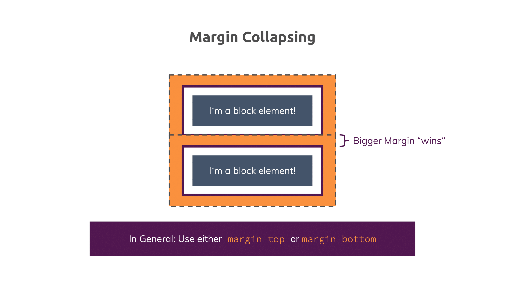

# Lesson 6

Understanding the box model

## The Box Model

Introduction to the following:

- The Box Model
- Height & Width
- The "display" Property
- Pseudo Classes & Elements

This browser does not support PDFs. Please download the PDF to view it: <a href="css-box-model.pdf">Download PDF</a>.

</embed>

## Mastering margin collapsing

The top and bottom margins of blocks are sometimes combined (collapsed) into a single margin whose size is the largest of the individual margins (or just one of them, if they are equal), a behavior known as margin collapsing. Note that the margins of floating and absolutely positioned elements never collapse.

This browser does not support PDFs. Please download the PDF to view it: <a href="css-margin-collapsing.pdf">Download PDF</a>.

</embed>

https://developer.mozilla.org/en-US/docs/Web/CSS/CSS_Box_Model/Mastering_margin_collapsing

There, three base cases are described:

Adjacent siblings which both have margins
A parent which holds one or more child elements where the first and/ or last (or the only) child has margins
An element without content, padding, border and height
Let's explore these cases:

## 1. Adjacent Siblings

In this case, the first element might have a margin of 10px (on all sides let's say) and the second one has 5px (or 20px - the values don't matter).

CSS will collapse the margins and only add the bigger one between the elements. So if we got margins of 10px and 5px , a 10px margin would be added between the elements?

## 2. A parent with children that have a margin

To be precise, the first and/ or last or the only child has to have margins (top and/ or bottom). In that case, the parent elements margin will collapse with the child element(s)' margins. Again, the bigger margin wins and will be applied to the parent element.

If the parent element has padding, inline content (other than the child elements) or a border, this behavior should not occur, the child margin will instead be added to the content of the wrapping parent element.

## 3. An empty element with margins

This case probably doesn't occur that often but if you got an element with no content, no padding, no border and no height, then the top and bottom margin will be merged into one single margin. Again, the bigger one wins.
